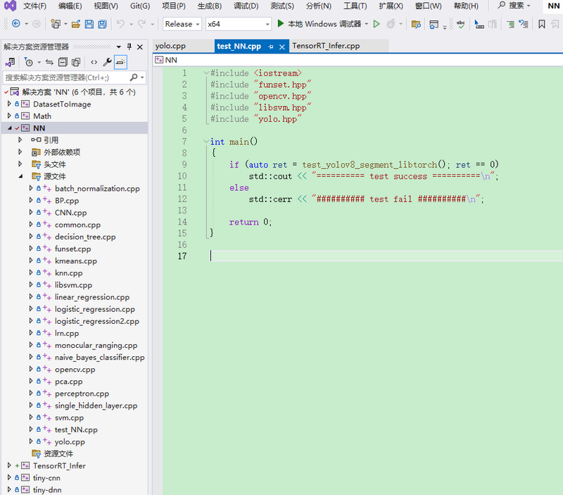

# NN_Test #
**This project contains some deep learning code(Note: depend on opencv/libtorch/onnxruntime):**
- deep learning code(C++)
	- Perceptron
	- BP(Back Propagation)
	- CNN(Convolutional Neural Networks)
	- Linear Regression(gradient descent、least squares)
	- Naive Bayes Classifier(sex classification)
	- Logistic Regression(gradient descent, Batch/Mini Batch)
	- KNN(K-Nearest Neighbor, classification)
	- PCA(Principal Components Analysis)
	- single hidden layer(two categories)
	- K-Means
	- Decision Tree(CART)
	- YOLOv8(OpenCV DNN, libtorch, onnxruntime)
		- Object Detection
		- Instance Segmentation
- mathematical formula's implement with C++
	- Linear Algebra
		- transpose
		- determinant
		- adjoint matrix
		- inverse matrix
		- norm(vector、matrix)
		- eigenvalues/eigenvectors(real symmetric matrix)
		- SVD(Singular Value Decomposition)
		- pseudoinverse
		- trace
	- Probability
		- mean、variance、standard deviation
		- covariance matrix
	- Activation Function
		- logistic sigmoid function
		- softplus function
		- ReLU(rectified linear unit)
		- Leaky ReLUs(leaky rectified linear units)
		- ELUs(Exponential linear units)
		- softmax function
		- tanh(Hyperbolic tangent)
	- Loss Function
		- MSE(Mean Square Error)
		- Cross-Entropy
	- Optimization
		- BGD(Batch Gradient Descent)
		- SGD(Stochastic Gradient Descent)
		- MBGD(Mini-batch Gradient Descent)
		- SGD with Momentum
		- AdaGrad(Adaptive Gradient)
		- RMSProp(Root Mean Square Propagation)
		- Adadelta(an adaptive learning rate method)
		- Adam(Adaptive Moment Estimation)
		- AdaMax(a variant of Adam based on the infinity norm)
		- NAG(Nesterov Accelerated Gradient)
		- Nadam(Nesterov-accelerated Adaptive Moment Estimation)
	- Layers
		- Dropout
		- LRN(Local Response Normalization)
		- BN(Batch Normalization)
	- common algorithm
		- Brute Force(string match)
		- Triangle similarity(monocular ranging)
- Database convert to Images or Images conver to Database
	- MNIST
	- CIFAR10/CIFAR100
	- ORL Faces Database
- open source library's usage(C++)
	- tiny-cnn [GitHub](https://github.com/nyanp/tiny-cnn)
	- tiny-dnn [GitHub](https://github.com/tiny-dnn/tiny-dnn)
	- libsvm [GitHub](https://github.com/cjlin1/libsvm)
	- tensorrt infer [GitHub](https://github.com/shouxieai/infer)
	- OpenCV [GitHub](https://github.com/opencv/opencv)
		- Logistic Regression
		- Support Vector Machines(SVM)
		- KNN(K-Nearest Neighbor)
		- Decision Tree
		- PCA(Principal Components Analysis)
		- k-means
- Python code(support windows and linux platform)
	- Universal Configuration
		- Installation(Anaconda)
			```
			conda create -n NN_Test python=3.9
			conda activate NN_Test
			pip install -r requirements.txt
			git clone https://github.com/fengbingchun/NN_Test
			cd NN_Test/demo/Python
			```
		- Code
			- [KNN(K-Nearest Neighbor)](demo/Python/test_knn_classification.py)
			- [Decision Tree(CART)](demo/Python/test_decision_tree_classification.py)
			- [PCA(Principal Components Analysis)](demo/Python/test_pca.py)
			- k-means
				- [k-means](demo/Python/test_k-means.py)
				- [k-menas opencv](demo/Python/test_k-means_opencv.py)
			- [txt to csv](demo/Python/test_txt_to_csv_convert.py)
	- MediaPipe
		- Installation(Anaconda)
			```
			conda create -n MediaPipe python=3.9
			conda activate MediaPipe
			pip install mediapipe
			pip install requests
			git clone https://github.com/fengbingchun/NN_Test
			cd NN_Test/demo/Python
			```
		- Code
			- [face monocular ranging](demo/Python/test_mediapipe_midas_face_monocular_ranging.py)
	- Ultralytics
		- Installation(Anaconda)
			```
			# cpu
			conda create --name ultralytics-env python=3.8 -y
			conda activate ultralytics-env
			pip install ultralytics

			# cuda
			# install cuda 11.8
			# install cudnn v8.7.0: copy the contents of bin,include,lib/x64 cudnn directories to the corresponding CUDA directories
			# install tensorrt 8.5.3.1:
			#	copy the contents of bin,include,lib/*.lib,lib/*.dll tensorrt directories to the corresponding CUDA directories
			# 	enter the python directory: pip install tensorrt-8.5.3.1-cp38-none-win_amd64.whl
			conda create --name ultralytics-env-cuda python=3.8 -y
			conda activate ultralytics-env-cuda
			conda install -c pytorch -c nvidia -c conda-forge pytorch==2.2.2 torchvision==0.17.2 torchaudio==2.2.2 pytorch-cuda=11.8 ultralytics # pytorch 2.2.2
			conda install -c conda-forge openvino=2024.0.0 # keep the same version as libopenvino
			pip install nncf==2.8.0 # openvino INT8 need
			pip install openpyxl # write excel file
			pip install moviepy # parse video file

			git clone https://github.com/fengbingchun/NN_Test
			cd NN_Test/demo/Python
			```
		- Code
			- [LabelMe JSON to YOLOv8 TXT: Detect](demo/Python/test_labelme2yolov8_detect.py)
			- [EISeg JSON to YOLOV8 TXT: Segment](demo/Python/test_eiseg2yolov8_segment.py)
			- [YOLOv8 train: detect/segment/classify](demo/Python/test_yolov8_train.py)
			- [YOLOv8 predict: detect/segment/classify](demo/Python/test_yolov8_predict.py)
			- [YOLOv8 segment onnxruntime predict](demo/Python/test_yolov8_segment_onnxruntime_predict.py)
			- [image classify: include AlexNet, ResNet, DenseNet](demo/Python/test_classify.py)
			- [YOLOv8 preprocess: detect/segment](demo/Python/test_yolov8_preprocess.py)
			- [YOLOv8 postprocess: detect/segment](demo/Python/test_yolov8_postprocess.py)
			- [PyTorch learning rate warmup](demo/Python/test_learning_rate_warmup.py)

**The project support platform:**
- windows10 64 bits: It can be directly build with VS2022 in windows10 64bits.
- Linux:
	- DatasetToImage support cmake build(file position: prj/linux_cmake_DatasetToImage)
	- Math support cmake build(file position: prj/linux_cmake_Math)
	- tiny-cnn support cmake build(file position: prj/linux_cmake_tiny-cnn)
	- tiny-dnn support cmake build(file position: prj/linux_cmake_tiny-dnn)
	- NN support cmake build(file position: prj/linux_cmake_NN)

**Windows VS Screenshot:**



**Blog:** [fengbingchun](https://blog.csdn.net/fengbingchun/category_3185667.html)

